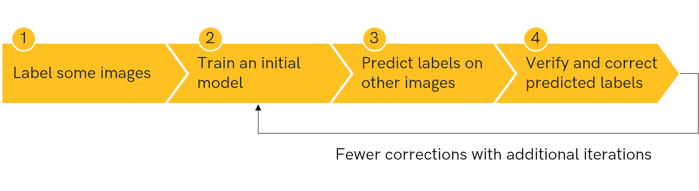

This repository contains the code for the blogpost [Speed up your labeling workflow for image segmentation](https://segments.ai/blog/speed-up-labeling-workflow-image-segmentation) on [Segments.ai](https://segments.ai).

# Speed up your labeling workflow for image segmentation

A large dataset of labeled images is the first thing you need in any serious computer vision project.
Building such datasets is a time-consuming endeavour, involving lots of manual labeling work. This is especially true for tasks like image segmentation where the labels need to be very precise.

One way to drastically speed up image labeling is by leveraging your machine learning models from the start. 
Instead of labeling the entire dataset manually, you can use your model to help you by iterating between image labeling and model training.

This tutorial will show you how to achieve such a fast labeling workflow for image segmentation with Segments.ai.

[Segments.ai](https://segments.ai) is a labeling platform with powerful automation tools for image segmentation. 
It also features a flexible API and Python SDK, which enable you to quickly set up custom workflows by uploading images and labels directly from your code.

We will walk you through a simple but efficient setup:

1. Upload your images to Segments.ai, and label a small subset.
2. Train a segmentation model on the labeled images.
3. Generate label predictions on the remaining images and upload them.
4. Correct the mistakes.

You can find all code for this tutorial on [Github](https://github.com/segments-ai/fast-labeling-workflow), or follow along on [Google Colab](https://colab.research.google.com/github/segments-ai/fast-labeling-workflow/blob/master/demo.ipynb).

Read the [full blogpost](https://segments.ai/blog/speed-up-labeling-workflow-image-segmentation) on [Segments.ai](https://segments.ai).
